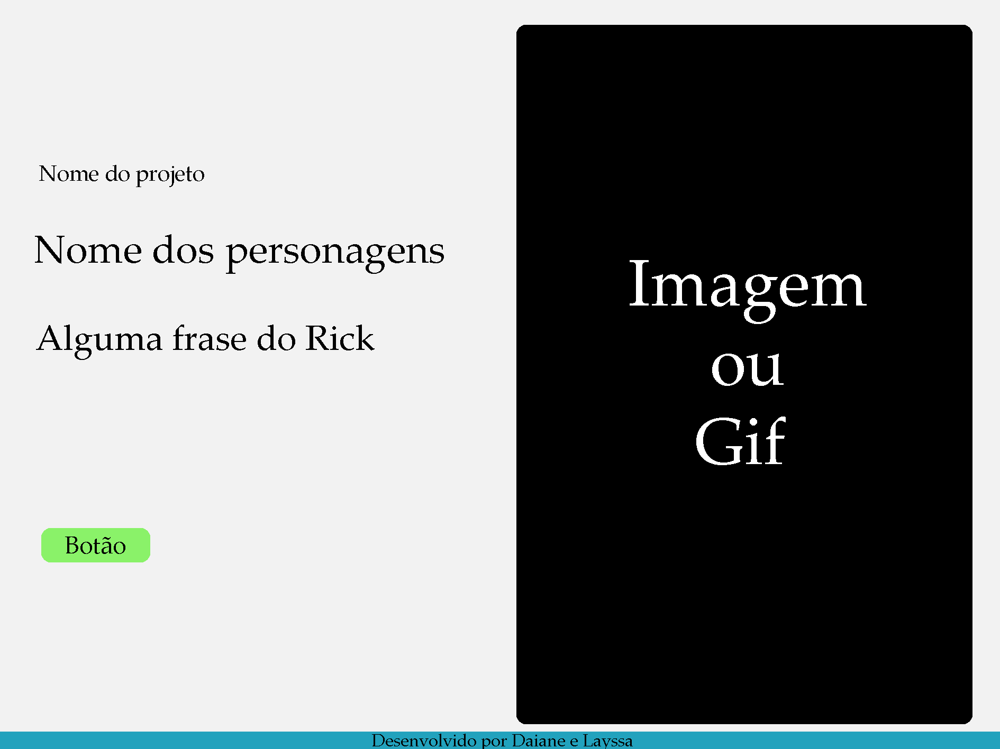
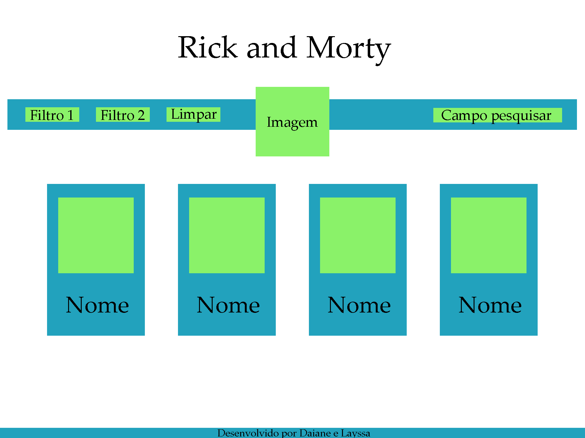
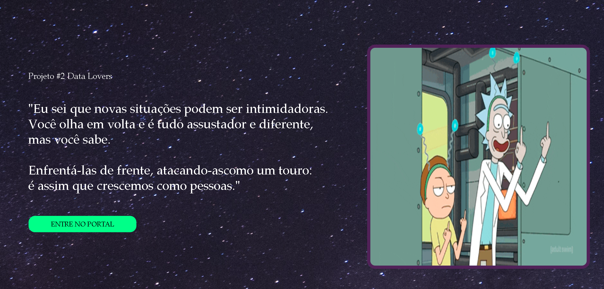
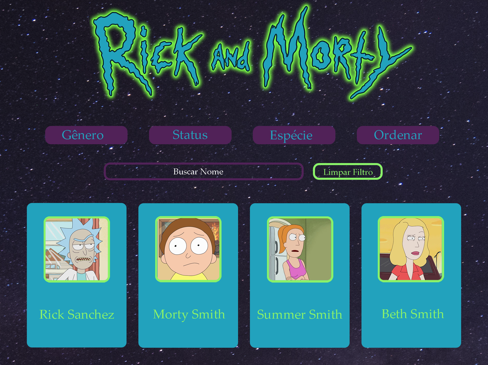
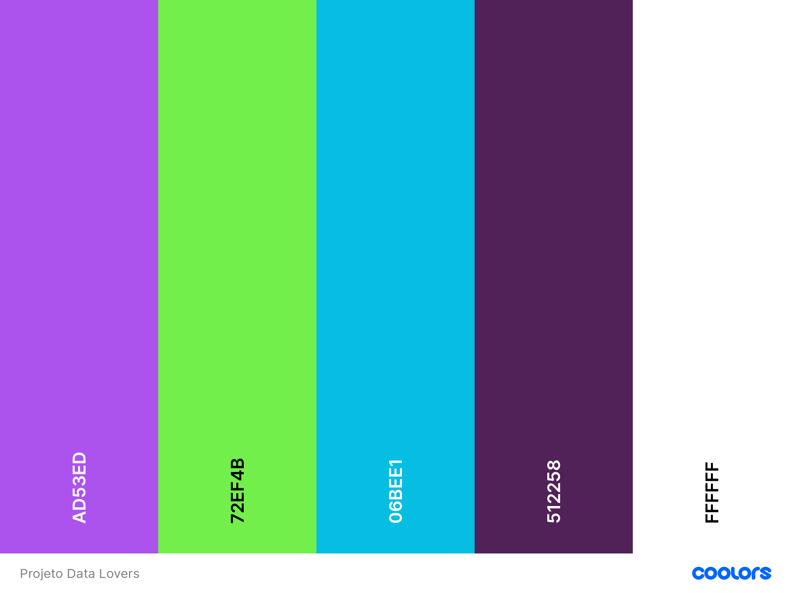

# Data Lovers

## Índice

- [1. Projeto 2 - Data Lovers](#1-projeto-2-data-lovers)
- [2. Usuário](#2-usuário)
- [3. Histórias do usuário](#3-histórias-do-usuário)
- [4. Protótipos](#4-protótipos)
- [5. Testes unitários](#5-testes-unitários)
- [6. Tecnologias](#6-tecnologias)
- [7. Considerações técnicas](#7-considerações-técnicas)
- [8. Resultado](#8-resultado)
- [9. Desenvolvedoras](#9-desenvolvedoras)

---

## 1. Projeto 2 - Data Lovers

Neste projeto foi criada uma página web com o objetivo de disponibilizar aos fãs dados sobre o desenho "Rick and Morty".

Por meio do site, o usuário tem a experiência de navegar pelo o universo dos seus personagens favoritos e outras informações até então desconhecidas.

Para fornecer tal experiência, utilizamos o consumo e manipulação da API rickandmorty.js.

---

## 2. Usuário

Ao navegar pelas redes sociais, grupos de interação e hashtags, percebemos que, claro, exsitem muitas informações acerca do desenho, no entanto dispersas. Por isso, afim de concentrar os dados num único local, como uma biblioteca, e facilitar a vida dos fãs, idealizamos o "Portal Rick and Morty".

Para orientar a nossa ideia e construção do código, foram escritas as histórias do usuário a seguir.

### 3. Histórias do usuário

#### 3.1 O usuário quer visualizar todos os personagens.

Para isso criamos cards para cada personagem e suas respecptivas fotos.

#### 3.2. O usuário quer ver as informações de cada personagem.

Aqui acrescentamos em cima do card uma animação com as informações.

#### 3.3 O usuário quer navegar nas informações e fazer buscas específicas, por meio de filtros.

Utiizamos um formulário para identicar quais filtros seriam interessantes para os fãs. Os 4 principais foram: gênero, status, espécie e ordenação alfabética.

#### 3.4 O usuário quer buscar pelo nome

Como existem 493 personagens, pode ser difícil achar sua personagem favorita. Portanto, para facilitar a usabilidade, inserimos um campo de busca.

#### 3.5 O usuário quer saber quanto esses filtros retornam em porcentagem.

Ex: uma fã do desenho se interessa por questões de gênero e quer saber quantas personagens femininas existem, qual a porcentagem delas nesse universo.

#### 3.6 O usuário quer fazer novas buscas e não quer dar refresh na tela, mas sim um botão que limpe todos os campos.

Inserimos um botão "limpar filtros".

---

## 4. Protótipos

### 4.1 Protótipo de baixa fidelidade

4.1.1 Página de boas vindas

4.1.2 Página principal

### 4.2 Protótipo de alta fidelidade

4.2.1 Página de boas vindas

4.2.2 Página principal com os Cards

### 4.3 Paleta de cores

Uitlizamos o site coolors.com para sua criação.

---

## 5. Testes unitários

Os testes unitários foram desenvolvidos para fazer com que o projeto rode adequadamente, nele você consegue verificar se cada função está dando o retorno esperado.

---

## 6. Teste de usabilidade

Após a primeira pesquisa com potenciais usuários e mapeamento das suas necessidades enquanto fãs, e consequentemente a construção das histórias do usuário, criamos também um formulário para os fãs deixarem seu feedback após testarem o site.

## 

---

## 7. Tecnologias

## 8. Resultado

8.1 Celulares e tablets

## 

## 9. Desenvolvedoras

<h2><a style="color:purple" href="https://github.com/lalaonde" target="_blank">Layssa Aragão</a> e <a style="color:purple" href="https://github.com/daianeoltramari">Daiane Oltramari</a></h2>

